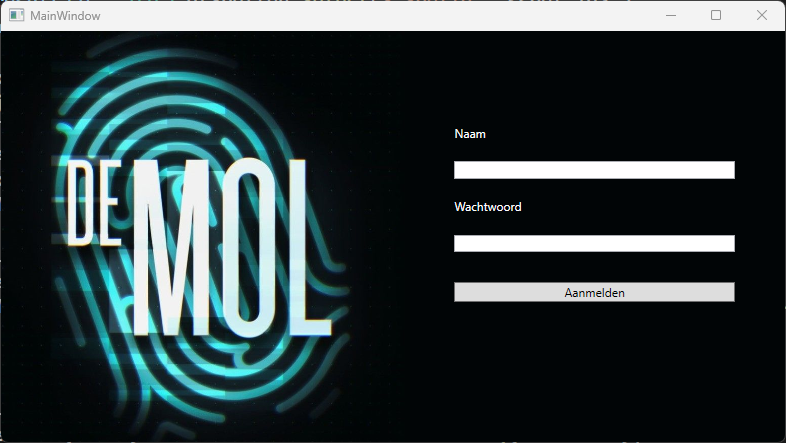

Disconnected ADO.NET: De Mol

De spelers van De Mol moeten hun status in het spel kunnen opzoeken via
een

applicatie waarmee ze kunnen achterhalen of ze de mol zijn. Verder
kunnen ze in

een profielvenster zien wanneer en waar hun spel verloopt.

MainWindow

ProfileWindow voor een speler

ProfileWindow voor de mol

Opgave:

1.  Maak gebruik van disconnected ADO.NET en gebruik volgende 2
    datatables:

dtSpellen:

-   SpelId (int) - PK

-   Jaar (int)

-   Locatie (string)

dtSpelers:

-   SpelerId (int) - PK

-   SpelId (int) - FK naar dtSpellen

-   Naam (string)

-   Wachtwoord (string)

-   IsMol (bool)

-   LeeftijdTijdensDeelname (int)

-   Beroep (string)

2.  Als speler kan ik de invoervelden voor naam en wachtwoord gebruiken
    om mee in te loggen. Indien er één of meer regels in de database
    zitten die dezelfde naam en hetzelfde wachtwoord hebben, dan wordt
    ik ingelogd.

3.  Als een speler wordt ingelogd, dan wordt het profielvenster getoond
    met de informatie van de ingelogde speler.

4.  Afhankelijk van de status van de speler wordt de tekst in de
    respectievelijke kleur getoond in het profielvenster.

// De mol kleur : #e0371d

> // De niet mol kleur : #61f1f1

5.  Afhankelijk van de status van de ingelogde speler wordt de
    afbeelding aangepast:

    a.  De mol ziet de afbeelding: "DeMolRed.jpg"

    b.  De niet-mollen zien de afbeelding: "DeMol.jpg"

Tips:

1.  Maak gebruik van een methode ZetKleur(Color kleur) die de tekst in
    het profielvenster van kleur verandert.

2.  Maak gebruik van een methode GetSpel die het spel van de speler
    ophaalt uit de "database".

3.  Het aanpassen van een imagesource doe je m.b.v. een BitmapImage en
    een Uri.
